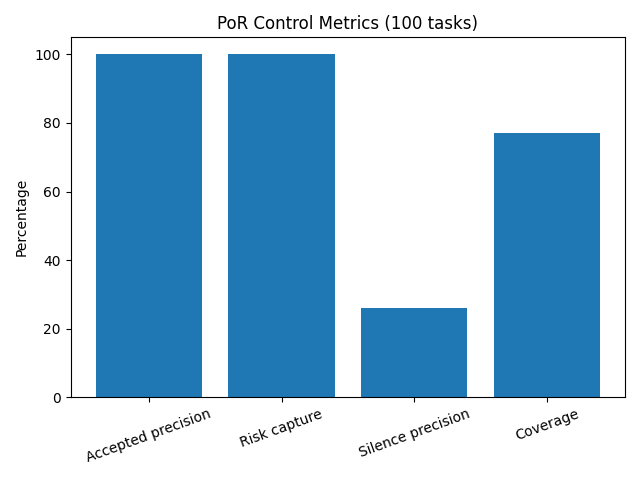

# Silence-as-Control

Silence-as-Control is a runtime control-layer primitive for LLM systems. It applies Proof-of-Resonance (PoR) stability signals as a release gate between generation and user-visible output. It is release control, not model improvement.

**Either correct, or silent.**

PoR does not improve the model itself. It controls when the model is allowed to produce output.

**Same model. Different decision.**

## What this is

- A PoR-based release gate.
- A decision layer for whether output is released.
- An explicit silence outcome when output is unstable.
- A separation between generation and release.

## What this is not

- Not a new model.
- Not a decoder replacement.
- Not prompt engineering.
- Not a claim of guaranteed truth.

## Start here

- `README.md` (this file): overview and entry points.
- `wiki/index.md`: concepts, architecture, runs, and supporting evidence.
- `wiki/meta/Evidence_Map.md`: claim-to-artifact audit trail.

## API surface

- `GET /health`
- `POST /por/evaluate`
- `POST /generate`
- `POST /por/complete`

## Quickstart (Windows / PowerShell)

```powershell
py -m venv .venv
.\.venv\Scripts\Activate.ps1
python -m pip install --upgrade pip
pip install -r requirements.txt
pip install -e .
uvicorn api.main:app --reload
```

Optional check:

```powershell
pytest -q
```

## Demo entry points

```powershell
python demo/por_api_demo.py
python demo/por_agent_demo.py
```

## Tracked operating points

Selected tracked operating points:

- **Run #4 — 300 tasks (threshold 0.35)**
- **Run #5 — 1000 tasks (threshold 0.35)**
- **Run #5 — 1000 tasks (threshold 0.43)**
- **Run #6 — 1000 tasks (threshold 0.39)**

Threshold is a control dial for release behavior. For run-level interpretation and supporting details, use `wiki/runs/` and `wiki/meta/Evidence_Map.md`.

## Visual proof




Additional tracked plots:

- `reports/drift.png`
- `reports/drift_clean.png`

## Reports and tracked artifacts

- `reports/eval_35_tasks.jsonl`
- `reports/eval_100_tasks.jsonl`
- `reports/eval_run2_100_tasks.jsonl`
- `reports/eval_run3.jsonl`
- `reports/eval_run4_300_threshold_035.jsonl`
- `reports/eval_run5_1000_threshold_035.jsonl`
- `reports/eval_run5_1000_threshold_042.jsonl`
- `reports/eval_run5_1000_threshold_043.jsonl`
- `reports/eval_run6_1000_threshold_039.jsonl`

---

Silence-as-Control leaves model weights and architecture unchanged and enforces runtime release decisions under stability constraints.
