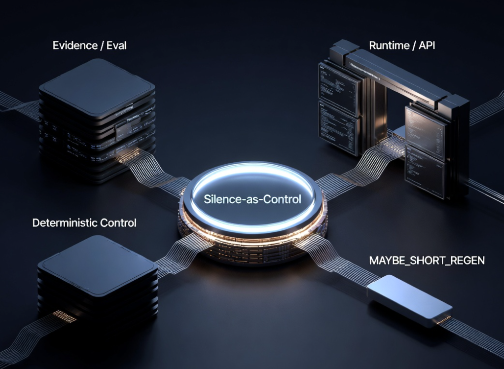

# Silence-as-Control

Silence-as-Control is a runtime control-layer primitive for LLM systems. It applies Proof-of-Resonance (PoR) stability signals as a release gate between generation and user-visible output. It is release control, not model improvement.

**Either correct, or silent.**

PoR does not improve the model itself. It controls when the model is allowed to produce output.

**Same model. Different decision.**

## What this is

- A PoR-based release gate.
- A decision layer for whether output is released.
- An explicit silence outcome when output is unstable.
- A separation between generation and release.

## What this is not

- Not a new model.
- Not a decoder replacement.
- Not prompt engineering.
- Not a claim of guaranteed truth.

## Start here

- `README.md` (this file): overview and entry points.
- `wiki/index.md`: concepts, architecture, runs, and supporting evidence.
- `wiki/meta/Evidence_Map.md`: claim-to-artifact audit trail.

## Fast orientation

1. Run the canonical demo: `python demo/canonical_demo.py`
2. Read the baseline vs PoR quick guide: `docs/baseline_vs_por_quick_guide.md`
3. Read the integration path guide: `docs/integration_path.md`
4. Use `CONTRIBUTING.md` for future work

## Repository Architecture



*Repository architecture across Evidence / Eval, Runtime / API, Deterministic Control, and the MAYBE_SHORT_REGEN extension lane.*

## Repository layout

- `api/` -> runtime API surface
- `src/` -> core package implementation
- `tests/` -> automated verification
- `demo/` -> runnable demonstration entry points
- `reports/` -> tracked artifacts and visuals
- `scripts/` -> support evaluation and analysis utilities
- `archive/` -> preserved historical and legacy material
- `wiki/` -> concepts, architecture, runs, and evidence

## API surface

- `GET /health`
- `POST /por/evaluate`
- `POST /generate`
- `POST /por/complete`

## Quickstart (Windows / PowerShell)

Recommended Python versions: **3.11**, **3.12**, or **3.13**.

### Minimal runtime setup

```powershell
py -m venv .venv
.\.venv\Scripts\Activate.ps1
python -m pip install --upgrade pip
pip install -r requirements.txt
uvicorn api.main:app --reload
```

### Optional editable developer install

```powershell
pip install -e .
```

Editable install is optional and mainly for active developer workflows.
For the lowest-friction local setup, use `pip install -r requirements.txt`.
A working editable-install path has been verified on Python 3.13.
On very new Python versions, if `pip install -e .` does not complete, you can continue; the API, tests, and demos run without it.

### Optional check

```powershell
pytest -q
```

### Demo entry points

Run this first:

```powershell
python demo/canonical_demo.py
```

Other demos:

Run this first:

python demo/canonical_demo.py

No API key required. Shows the baseline vs PoR contrast in one local run.

```powershell
python demo/por_api_demo.py
python demo/por_agent_demo.py
```

## Signal and threshold contract (read this before comparing layers)

- **Canonical for reported evidence**: eval pipeline and run artifacts (`scripts/live_eval_openai.py`, `reports/*`, `wiki/runs/*`).
- **Runtime/demo threshold**: local API gate semantics in `api/main.py` (default `0.39` for runtime heuristics).
- **Deterministic library control contract**: tested library gate in `src/silence_as_control/control.py` (`coherence >= 0.7`, `drift <= 0.3`).

These are intentionally different contracts. See `docs/signal_and_threshold_contract.md` for the canonical cross-layer definition.

## Tracked operating points

Selected tracked operating points:

- **Run #4 — 300 tasks (threshold 0.35)**
- **Run #5 — 1000 tasks (threshold 0.35)**
- **Run #5 — 1000 tasks (threshold 0.43)**
- **Run #6 — 1000 tasks (threshold 0.39)**

Threshold is a control dial for release behavior. For run-level interpretation and supporting details, use `wiki/runs/` and `wiki/meta/Evidence_Map.md`.

## Selected evidence snapshots


*Threshold operating-mode behavior across tracked runs.*


*Failure leakage appears at boundary/aggressive thresholds and returns to zero at the conservative-safe setting.*


*Success/failure drift separation remains visible across operating points.*

For additional visuals and run artifacts, see `reports/README.md`.

## Silence-rate workstream (recent docs)

- `docs/silence_rate_roadmap.md`
- `docs/borderline_pocket_findings.md`
- `docs/first_extension_experiment.md`
- `docs/short_regen_sandbox_findings.md`
- `docs/maybe_short_regen_formalization.md`

## Reports and tracked artifacts

- `reports/eval_35_tasks.jsonl`
- `reports/eval_100_tasks.jsonl`
- `reports/eval_run2_100_tasks.jsonl`
- `reports/eval_run3.jsonl`
- `reports/eval_run4_300_threshold_035.jsonl`
- `reports/eval_run5_1000_threshold_035.jsonl`
- `reports/eval_run5_1000_threshold_042.jsonl`
- `reports/eval_run5_1000_threshold_043.jsonl`
- `reports/eval_run6_1000_threshold_039.jsonl`

---

Silence-as-Control leaves model weights and architecture unchanged and enforces runtime release decisions under stability constraints.
