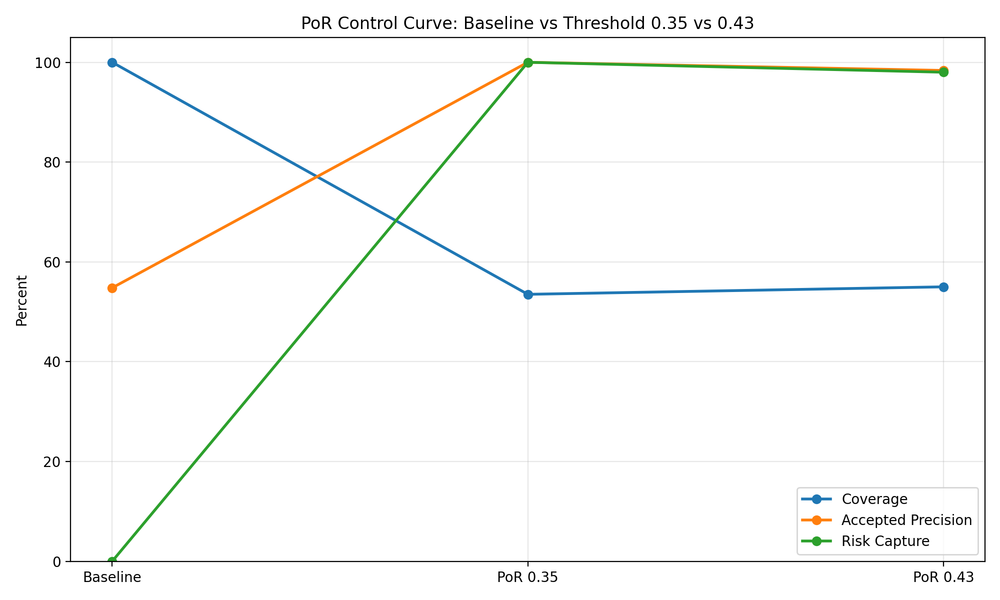
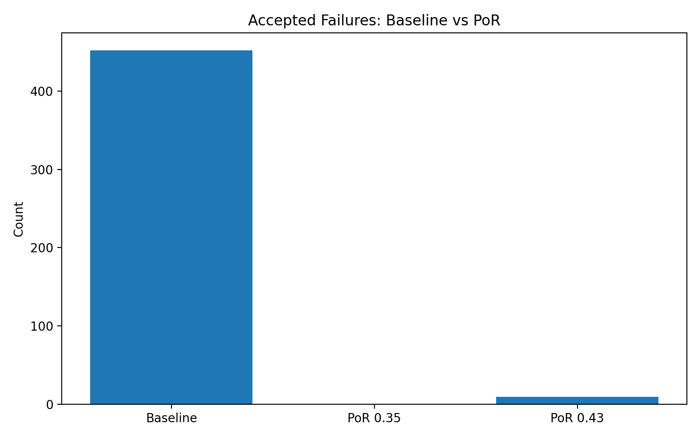
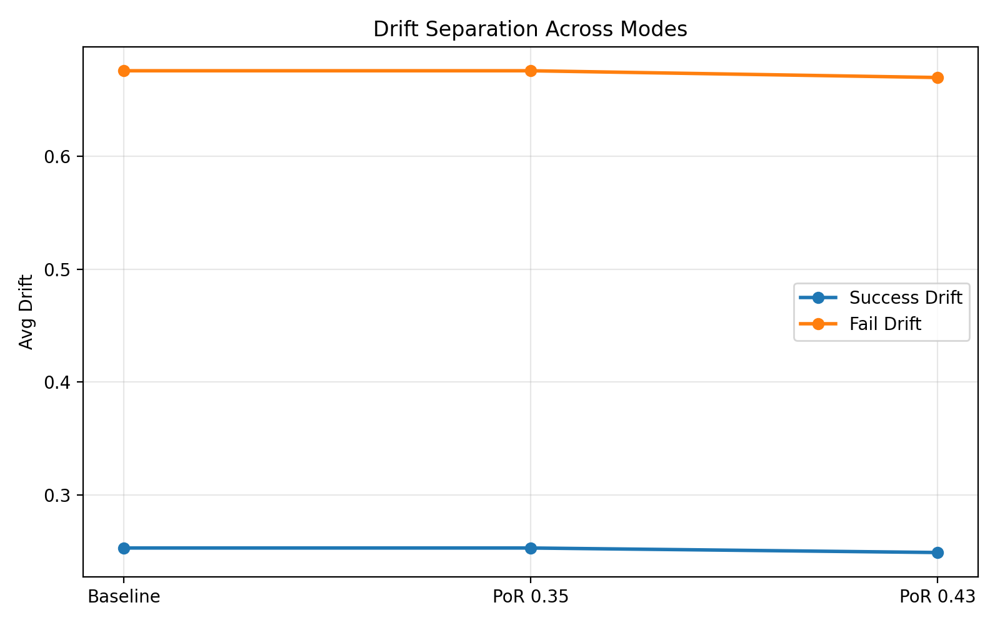

from pathlib import Path

readme_content = """# Silence-as-Control

Silence-as-Control is a control-layer middleware that decides whether to return or suppress AI output based on explicit stability signals.

## What it is

A minimal Python middleware layer with deterministic gating logic:
- Accepts an output candidate plus stability signals (coherence, drift)
- Returns output when signals are within bounds
- Returns an explicit abstention state when signals are unstable

## Core idea

LLMs should not always answer.

If the system state is unstable -> abstain  
If the system state is stable -> proceed  

Silence is not failure - it is a control signal.

## Why abstention is a valid state

Abstention is a first-class response that prevents unstable output from being returned.

The middleware returns:
- {"status": "ok", "output": ...}
- {"status": "abstained", "reason": "control_abstention"}

## Repository structure

silence-as-control/
├── src/silence_as_control/
│   ├── __init__.py
│   ├── control.py
│   ├── abstention.py
│   ├── schema.py
│   └── logging_utils.py
├── api/main.py
├── tests/
│   ├── test_control.py
│   └── test_api.py
├── .github/workflows/ci.yml
├── .gitignore
├── README.md
├── requirements.txt
├── pyproject.toml
└── Dockerfile

## Quickstart

python -m venv .venv
source .venv/bin/activate
pip install -r requirements.txt
pip install -e .
uvicorn api.main:app --reload

## API example

Request:
{"output":"text","coherence":0.82,"drift":0.15}

Response (stable):
{"status":"ok","output":"text"}

Response (abstained):
{"status":"abstained","reason":"control_abstention"}

## Test command

pytest

# Evaluation Results (PoR)

## Run #1 — 35 tasks
- Silence rate: 14.3%
- Coverage: 85.7%
- Accepted precision: 100%
- Risk capture: 100%
- Silence precision: 40%
Drift:
success: 0.218
fail: 0.566
separation: ~2.60x

## Run #2 — 100 tasks
- Silence rate: 27.0%
- Coverage: 73.0%
- Accepted precision: 100%
- Risk capture: 100%
- Silence precision: 22.22%
Drift:
success: 0.245
fail: 0.540
separation: ~2.20x

## Run #3 — 100 tasks
- Silence rate: 24.0%
- Coverage: 76.0%
- Accepted precision: 100%
- Risk capture: 100%
- Silence precision: 20.83%
Drift:
success: 0.242
fail: 0.571
separation: ~2.36x

## Run #4 — 300 tasks (threshold = 0.35)
- Silence rate: 36.0%
- Coverage: 64.0%
- Accepted precision: 100%
- Risk capture: 100%
- Silence precision: 96.3%
Drift:
success: 0.254
fail: 0.716
separation: ~2.82x

## Run #5 — 1000 tasks (threshold = 0.35)
- Silence rate: 46.5%
- Coverage: 53.5%
- Accepted precision: 100%
- Risk capture: 100%
- Silence precision: 93.76%
Drift:
success: 0.253
fail: 0.676
separation: ~2.67x

## Run #5 — 1000 tasks (threshold = 0.43)
- Silence rate: 45.0%
- Coverage: 55.0%
- Accepted precision: 98.36%
- Risk capture: 98.01%
- Silence precision: 98.44%
Drift:
success: 0.249
fail: 0.670
separation: ~2.70x

## Key Insight

PoR does not improve the model.

It controls when the model is allowed to produce output.

This creates a tunable trade-off between safety and usability.

## Visual Proof

Control curve:

Accepted failures:

Drift separation:

## Conclusion

Proof-of-Resonance (PoR) demonstrates:
- drift is measurable
- drift correlates with correctness
- threshold gating controls unsafe outputs
- abstention is a precise control mechanism

PoR acts as a control layer primitive for LLM systems.
"""

Path("README.md").write_text(readme_content, encoding="utf-8")

print("README.md updated (single-block clean version) ✅")