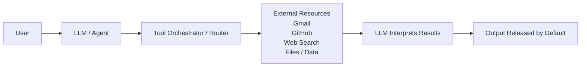
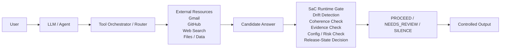

# Agentic Release-Control Architecture

This document is a post-PR-200 bridge from the July 2026 roadmap into agentic systems. Modern agentic systems increase the cost of language-model failure because generated text is no longer only an answer. It may become an instruction, a tool argument, a file mutation, a repository action, or a configuration change. When the same system can retrieve evidence, route tools, interpret results, and initiate downstream work, a plausible but unsupported generation can become operational authority unless release is explicitly governed.

Silence-as-Control (SaC) treats release as a runtime decision rather than a default consequence of generation. The core principle is: **Generation is not authority. Release must be earned.** In agentic settings, this separates the model's capability to produce a candidate from the system's authority to expose that candidate or allow it to drive action. **Agent capability is not release authority.**

## Current Paradigm: Release by Default

In the current default pattern, the agent receives a user request, invokes tools through an orchestrator or router, receives external results, and then generates a final answer. Unless a separate control layer intervenes, the generated answer is released by default. The practical issue is that generation becomes authority: the LLM's final text is treated as the release decision.

This pattern is simple, but it couples tool use, interpretation, and release. The orchestrator decides what to call; the model decides what to say; and the system releases the result unless something fails mechanically. A coherent hallucination, stale evidence, ambiguous tool output, or unsafe configuration mutation can still be released if it is well-formed.

## Proposed Paradigm: Governed Release

The proposed pattern inserts a SaC runtime gate between candidate generation and user-visible release. The agent and tools remain the same, but the release authority changes. **Same agent. Same tools. Different release authority.**

SaC does not replace the LLM, the tool router, or domain-specific application logic. It adds a release-control layer that evaluates whether the candidate has earned release under explicit runtime criteria. Ordinary tool orchestration answers the question, "Which tool should be called next?" Agentic release control answers a different question: "May this candidate be released now?"

## Runtime Gate Checks

A minimal SaC runtime gate can evaluate several deterministic or auditable signals:

- **Drift Detection:** whether the candidate has moved away from the user request, tool result, or known task boundary.
- **Coherence Check:** whether the candidate is internally consistent and aligned with the available context.
- **Evidence Check:** whether the answer is supported by tool results rather than unsupported assertion.
- **Config / Risk Check:** whether the candidate attempts risky actions such as unsafe configuration mutation, approval bypass, or destructive commands.
- **Release-State Decision:** whether the combined signals justify release, human review, or controlled silence.

The gate is a runtime control layer, not a model-improvement technique. It can be implemented with deterministic thresholds, policy rules, evidence schemas, model-based judges, or hybrid evaluators depending on deployment requirements. The reference demo in this repository uses deterministic rules only.

## Release States

- **PROCEED:** The candidate satisfies the configured runtime checks and may be released as controlled output.
- **NEEDS_REVIEW:** The candidate is not automatically released because evidence, drift, coherence, or confidence conditions are insufficient. A human reviewer or higher-assurance path may decide what happens next.
- **SILENCE:** The candidate is blocked from release because it violates a high-risk condition or fails a critical release rule. **Silence is not a crash; it is a controlled runtime decision.**

These states make abstention visible and auditable. Instead of treating failure only as an exception, timeout, or malformed response, the system records a release-state decision.

## Advantages

- **Quality control at system level:** release checks operate after candidate generation and can be standardized across agents.
- **Right-to-speak principle:** the system must earn the right to speak or act, rather than assuming output release by default.
- **Hallucination mitigation:** unsupported or drifted claims can be routed to review or silence before reaching users.
- **Increased trust and safety:** risky candidates can be blocked even when they are syntactically valid and confidently phrased.
- **Auditability and accountability:** release decisions can record reasons, thresholds, and risk signals for later inspection.
- **Standardization through Port of Release / PoR:** release behavior can be represented as an explicit interface between generation and exposure.
- **Extensibility across models, domains, and tools:** the gate can sit after different models, routers, and external resources without requiring a model rewrite.

## Limitations and Current Challenges

- **Added pipeline complexity:** release control introduces another component that must be configured, tested, and monitored.
- **Latency overhead:** checks may add runtime cost, especially if evidence retrieval or model-based evaluation is used.
- **False negatives and over-silence:** conservative gates may block useful answers or route too many cases to review.
- **Configuration sensitivity:** thresholds and risk rules must match the domain, task criticality, and acceptable failure modes.
- **Evaluation difficulty:** measuring accepted-wrong-output reduction, abstention quality, and review burden requires careful datasets.
- **Adoption barrier:** teams must adjust from release-by-default mental models to explicit release-state handling.
- **Resource consumption:** additional checks can consume compute, storage, and engineering attention.

## Scope and Non-Claims

This architecture does not claim:

- universal AI safety;
- perfect hallucination elimination;
- model improvement;
- replacement for human review in high-stakes systems;
- guaranteed correctness.

Instead, it demonstrates:

- runtime release governance;
- controlled abstention;
- separation of generation from release authority;
- auditable release-state behavior.

The practical claim is narrow: in agentic systems, release should be treated as a governed runtime state, not as an automatic side effect of generation.
